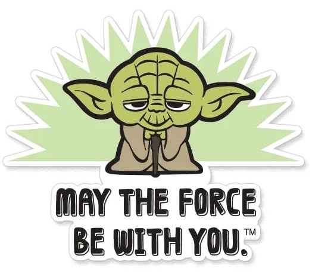

# M1 - Checkpoint

  

### Instrucciones

Te vamos a brindar los tests preparados, tu tarea es completar el código en `checkpoint.js` de tal forma que pasen la mayoría de los tests. Para ejecutar los tests, primero debes ejecutar el comando `npm install` dentro de esta carpeta (`CP-M1`). Luego, en esta misma carpeta podes ejecutar `npm test` para correr la totalidad de los tests o si queres ejecutar solo los tests de un ejercicio en praticular podes hacer `npm run test:n` siendo `n` el número del ejercicio que queremos ejecutar, por ejemplo `npm run test:7` para correr los tests asociados al ejercicio número `7`.

### Subir tu checkpoint

Una vez terminado el checkpoint, subir los cambios a tu repositorio con los comandos de siempre:

`git add *`
`git commit -m 'resolucion cp'`
`git push`

**Notas**:

* Sólo podés consultar al instructor por problemas de instrucciones o si no te funcionan los tests.
* Hay cosas que tal vez no vimos específicamente en los lectures, vas a tener que investigar un poquito por tu cuenta.
* Si estas en un cohorte A, tenes que subir el resultado del challenge antes de las 18:00 hs Argentina, de lo contrario si estas en un cohorte B, tenes hasta las 21:00 hs Argentina.
* Podés buscar en internet o en cualquier otro lugar por recursos para que te ayudes.
* No podés ayudar ni preguntar a tus compañeros de clases.

### Condiciones de aprobación

Para aprobar el checkpoint es necesario contar con un mínimo de 6 ejercicios correctos sobre los 10 totales. Para que un ejercicio sea considerado como correcto debe pasar todos los tests asociados a ese ejercicio. Para verificar este número podes hacer `npm run test` y mirar la cantidad de `test suites` pasadas. 
